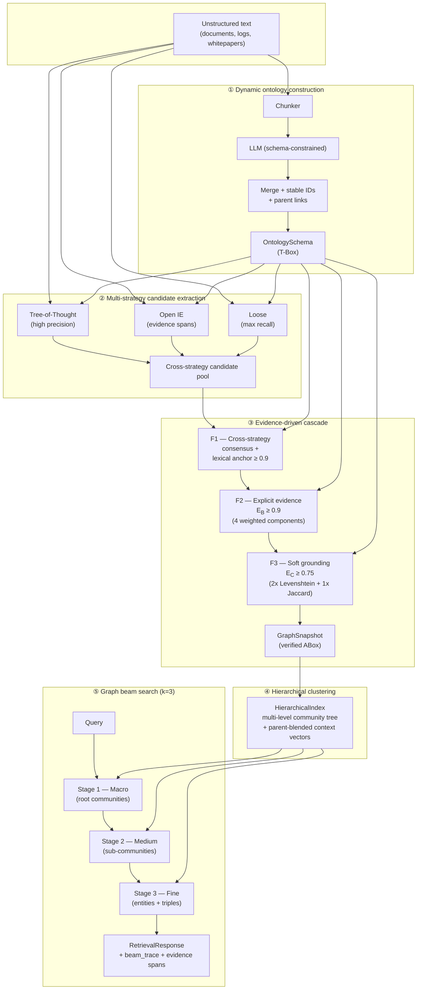

# DynamicOntology-GraphRAG

> A modular, domain-agnostic **GraphRAG** engine that builds its own
> ontology, runs **multi-strategy candidate extraction**, applies a
> **three-tier evidence-driven cascade** to scrub hallucinations, and
> retrieves via **hierarchical community clustering + Graph Beam
> Search** — with first-class support for fully local, edge-friendly
> LLM runtimes.

[]()
[]()
[]()
[]()

---

## ✨ Why this exists

Most GraphRAG stacks assume a pre-existing, human-curated ontology and
a single extraction prompt. Both assumptions break the moment you point
the system at a new domain. **DynamicOntology-GraphRAG** treats
*ontology construction* and *knowledge extraction* as a single,
co-designed pipeline:

1. The framework **induces the T-Box** (classes, relations, hierarchy)
   directly from your text, with stable IDs and support-based quality
   filters — no taxonomy hand-engineering.
2. Three **independent extraction strategies** (Tree-of-Thought,
   Open IE, and a permissive loose extractor) run in parallel. Their
   disagreements are *signal*, not noise.
3. A **three-tier cascade** —
   `F1 consensus → F2 E_B ≥ 0.9 → F3 E_C ≥ 0.75` — promotes facts only
   when they are corroborated by corpus-grounded evidence
   (verifiable spans, Jaccard-anchored conciseness, normalised
   Levenshtein grounding).
4. **Hierarchical community clustering** with parent-blended context
   vectors and a top-down navigation tree, so the retriever can answer
   coarse ("what is the web tier?") *and* precise ("which load
   balancer routes to api server 1?") queries without re-clustering.
5. **Three-stage Graph Beam Search** (k=3 by default) walks the tree
   coarse → medium → fine, scoring every candidate with cosine + lexical
   overlap blended against its parent's prior — and writing a full
   `beam_trace` so every result is explainable.

Everything is **pluggable**: swap the embedder, the summariser, the
community-detection backend, the reranker, the LLM client — or run the
whole thing **on a $50 edge box** with a 3 B local model behind Ollama.

---

## 🏛 Architecture



---

## 🚀 Quickstart

### 1 · Install

```bash
# Core runtime (LLM-only; no network graph yet)
pip install -e "."

# Full stack incl. community detection + retrieval
pip install -e ".[dev]"
# (already installs networkx via the base requirements)
```

Python ≥ 3.10 required. Tested on 3.11 and 3.13.

### 2 · Run the demo (zero-dependency)

```bash
python examples/demo.py
```

You should see five stages, then a structured report. **No API key is
needed** — the demo uses deterministic in-process mocks so the pipeline
runs end-to-end on a fresh checkout.

```text
--- Stage 1: Dynamic ontology generation (T-Box) ---------
    induced 4 classes, 3 relations
--- Stage 2: Multi-strategy candidate extraction ---------
    [A: Tree-of-Thought] entities=3  triples=2
    [B: Open IE       ] entities=4  triples=2
    [C: Loose         ] entities=3  triples=2
--- Stage 3: Evidence-driven cascade verification ---------
    accepted 5/6 candidates — F1 consensus: 2, F2 E_B≥0.9: 1, F3 E_C≥0.75: 2
    graph holds 4 deduplicated verified facts over 5 entities
--- Stage 4: Hierarchical community clustering -------------
    level 0: 2 communities
    level 1: 1 communities
--- Stage 5: Graph beam search retrieval (k=3) ------------
    [0.600] load balancer → api server 1   evidence='The load balancer routes requests to api server 1'
```

### 3 · Plug in a real LLM

```bash
export OPENAI_API_KEY=sk-...       # or
ollama serve && ollama pull qwen2.5:7b-instruct
```

```bash
python examples/demo.py --live
```

The framework will pick the first available backend: `OPENAI_API_KEY`
wins, otherwise it falls back to Ollama on `http://localhost:11434`.

### 4 · Run on the edge

```bash
docker build -t dograph:edge .
docker compose -f docker-compose.edge.yml up -d
#   ollama   →  local LLM + embeddings (data volume: ollama)
#   dograph  →  the framework container
```

See [`deploy_edge.md`](deploy_edge.md) for RKLLM, resource sizing, and
troubleshooting.

### 5 · Programmatic use (TL;DR)

```python
from connectors.llm_backend import default_backend
from core.schema_generator import SchemaGenerator
from core.candidate_extractor import MultiStrategyExtractor
from core.evidence_verifier import EvidenceVerifier
from core.models import Document
from retriever.pipeline import RetrievalPipeline

llm = default_backend()                # OpenAI or local Ollama
schema = SchemaGenerator(llm).build(["your text corpus…"])

extractor = MultiStrategyExtractor(llm=llm)
verifier = EvidenceVerifier()
pipe = RetrievalPipeline()

snapshot = None
for doc in corpus:
    ents, trips = extractor.extract([doc], schema=schema)  # returns per-doc list
    decisions, snap = verifier.verify_batch(trips, schema=schema, documents=[doc])
    snapshot = snap if snapshot is None else snapshot  # union across docs

pipe.build_index(snapshot)
response = pipe.retrieve("which load balancer routes to api server")
print(response.beam_trace)             # 3 stages, top-k per stage
for hit in response.triples[:5]:       # ranked, with provenance
    print(hit.score, hit.item.evidence)
```

---

## 🧩 Core modules

| Path | What lives here |
|---|---|
| `core/models.py` | All Pydantic v2 data contracts (`Entity`, `Triple`, `OntologySchema`, `CommunityNode`, `EvidenceScore`, `RetrievalResponse`, …) |
| `core/schema_generator.py` | ① Dynamic T-Box construction (chunk → LLM → JSON → `OntologySchema` with stable IDs) |
| `core/candidate_extractor.py` | ② Tree-of-Thought / Open IE / Loose extractors + parallel orchestrator |
| `core/evidence_verifier.py` | ③ Three-tier cascade: `E_B` (4-component weighted), `E_C` (Levenshtein + Jaccard), cross-strategy consensus, NetworkX persistence |
| `core/hierarchical_index.py` | ④ Bottom-up community clustering, parent-blended context vectors, navigation tree |
| `retriever/graph_beam_search.py` | ⑤ Coarse→medium→fine beam search with parent-score blending |
| `retriever/pipeline.py` | One-call retrieval façade (`RetrievalPipeline.retrieve`, `retrieve()`, `format_response`) |
| `connectors/llm_backend.py` | `StructuredLLM` over OpenAI / Ollama / any OpenAI-compatible endpoint, with JSON-schema and JSON-mode structured output |
| `examples/demo.py` | End-to-end runnable showcase (mock by default, `--live` for real LLM) |
| `deploy_edge.md` + `Dockerfile` + `docker-compose.edge.yml` | Edge deployment guide and image |

### Verification math (the bit that keeps your answers grounded)

**Believability** `E_B` (Filter 2):

$$E_B = 0.35\,C + 0.25\,S + 0.25\,O + 0.15\,J$$

`C` = triple complete match, `S` = subject match, `O` = object match,
`J` = span conciseness (Jaccard). Acceptance: `E_B ≥ 0.9`.

**Corroboration** `E_C` (Filter 3):

$$E_C = 0.45\,G_s + 0.45\,G_o + 0.10\,H$$

`G_s`, `G_o` = subject/object grounding (normalised Levenshtein),
`H` = triple coherence (Jaccard). Acceptance: `E_C ≥ 0.75`.

Filter 1 short-circuits both whenever ≥ 2 strategies agree *and* the
head/tail surface forms anchor in the source text with similarity
≥ 0.9.

---

## 🧪 Tests

```bash
pytest tests/                    # 57 tests, ≈ 0.5 s
pytest tests/integration/ -v     # 12 end-to-end tests with NetworkX
```

Coverage spans: text similarity primitives, every `E_B` / `E_C`
component, every cascade filter, dedup logic, the full demo, the
NetworkX round-trip, and the three-stage beam search.

---

## 🛣 Roadmap

- [ ] Real LLM end-to-end run (needs `OPENAI_API_KEY` or Ollama in CI)
- [ ] Leiden community detection backend (sits beside `GreedyModularityDetector`)
- [ ] Cross-encoder reranker behind the existing `Reranker` ABC
- [ ] FastAPI service scaffold (`dograph serve`)
- [ ] Optional igraph / rustworkx backend behind the same NetworkX adapter

---

## 🙏 Acknowledgements

Inspired by — and standing on the shoulders of — Microsoft's
**GraphRAG** project, LlamaIndex's hierarchical retriever, and the
Pydantic / NetworkX / scikit-learn maintainers who make all of this
ergonomically possible.

Built with curiosity, ship by ship.

## 📄 License

MIT — see [`LICENSE`](LICENSE).
